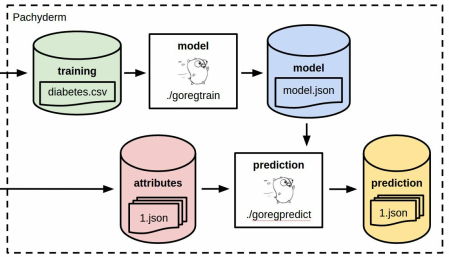

# Bases Machine Learning con Go

    - Código practico

## [1. Recopilación y organización de datos](./1_reunir-organizar_data/)

## [2. Matrices, probabilidad y estadística (unidades)](./2_matrices-probabilidad-y-estadisticas/)

## [3. Evaluación y validación (metricas)](./3_evaluacion-validacion/)

## [4. Regresión (técnicas)](./4_regresion/)

## [5. Clasificación (algoritmos modelos)](./5_clasificacion/)

## [6. Agrupamiento (técnicas no supervisadas)](./6_agrupamiento/)

## [7. Series de tiempo y detección de anomalías (técnicas datatime)](./7_series_de_tiempo-deteccion_anomalias/)

## [8. Redes neuronales y aprendizaje profundo (técnicas multimedia)](./8_red_neuronal-aprendizaje_profundo/)

## [9. Implementación y distribución de análisis-modelos (Docker + Pachyderm)](./9_Implementar-distribuir_análisis-modelos/)

